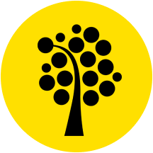
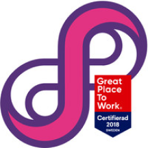

import ExperienceHeader from "../components/experience-header"
import AnimatedText from "../components/animated-text"
import Layout from "../components/layout"
import SEO from "../components/seo"
import Skills from "../components/skills"

<Layout>
<SEO title='About' description='A section about me and my CV.' />

# <AnimatedText>About.</AnimatedText>

I’m a bit of a jack of all trade. I’ve been mixing between graphical
design and programming since I was a teenager. Even though I love UX/UI
design, I’m most passionate about programming. Both on the frontend and
backend. I prefer functional programming, and Javascript is my language
of choice, but I love the opportunity to work with other functional
languages.

Most of my projects are available on [Github](https://github.com/antonstrand). If you want the good stuff directly, you can visit [tasktracker.se](https://tasktracker.se/project/5b14049c1363ca6d2dec1f62) or run `npx play-snake 20` to [play snake](https://www.npmjs.com/package/play-snake) in your terminal. 

When possible, my girlfriend, Victoria, our dog, Algot, and I often go
on trips with our self-built [camper van](https://www.instagram.com/jerrythevan/).

---

## Skills

<Skills>

- Javascript
- Git
- [NodeJS](https://nodejs.org/en/)
- [React](https://reactjs.org/)
- [Redux](https://redux.js.org/)
- [Express](https://expressjs.com/)
- [Gatsby](https://www.gatsbyjs.org/)
- [GraphQL](https://graphql.org/)
- API Design
- ReST API
- SQL
- NoSQL
- HTML5
- CSS3 
- [Paperplane](https://www.npmjs.com/package/paperplane/)
- [Ramda](http://ramdajs.com/)
- [Crocks (Algebraic Data Types)](https://crocks.dev/)
- [Sketch](https://www.sketch.com/)
- [Figma](https://www.figma.com/)
- Photoshop

</Skills>

---

## Work experience

<ExperienceHeader
  title="Project Assistant"
  period="Linnaeus University • June 2019 - present"
>

</ExperienceHeader>

- In charge of the university’s instance of Gitlab
- Create a CLI tool to generate course content automatically
- Help students with questions and teaching programming concepts
- Assess assignments, both code reviews, and oral examinations
- Create assignment workflows including CI pipelines
- Write instructions for getting started and using Git and Gitlab
- Create a course page template using [Gatsby](https://www.gatsbyjs.org/)

<ExperienceHeader
  title="Teaching Assistant"
  period="Linnaeus University • Sep 2018 - June 2019"
>

</ExperienceHeader>

- Help students with Git, Node, and Javascript
- Teach programming concepts
- Mentor on how to work using an agile work process 

<ExperienceHeader
  title="UX/UI Designer"
  period="Silverspin AB • Jan 2013 - present"
>

</ExperienceHeader>

- Design casino websites
- Involved in significant redesigns for both desktop and mobile
- Create Whitelabel templates
- Create promotion material, icons, banners and much more 

<ExperienceHeader
  title="Teacher"
  period="Teknikhögskolan • Sep 2012 - Dec 2012"
>

</ExperienceHeader>

- Teach ActionScript 3.0 and the foundation of OOP
- Create lecture material and assignments
- Assess and grade student assignments

---

## Education

<ExperienceHeader
  title="Bachelor degree in CS"
  period="Linnaeus University • Aug 2019 - June 2020"
>

</ExperienceHeader>

While I'm working at the university, I also study 50% to get a Bachelor's degree in computer science.

#### Courses
- Foundations of Software Technology, 7.5 credits (Algorithms & Data Structures)
- Web intelligence, 7.5 credits ([Machine Learning](https://github.com/AntonStrand/2DV515-A4-Machine-Learning), [Search Engine](https://github.com/AntonStrand/2DV515-A3-search-engine), [Clustering](https://github.com/AntonStrand/2DV515-A2-Clustering), [Recommendation System](https://github.com/AntonStrand/2DV515-a1-recommendation-system))
- Degree Project at Bachelor Level, 15 credits (A paper on how to use CI pipelines to assess programming assignments)

<ExperienceHeader
  title="Web Development"
  period="Linnaeus University • Aug 2017 - June 2019"
>

</ExperienceHeader>

Higher Education Certificate in web development.

#### Courses year 1
- Introduction to Programming, 7.5 credits
- Web Technology 1, 7.5 credits
- Client­-based Web Programming, 7.5 credits
- Graphical tools, 7.5 credits
- Software Technology, 7.5 credits
- Server­-based Web Programming, 7.5 credits
- Object-­Oriented Programming, 7.5 credits
- [Individual Software Development Project](https://github.com/antonstrand/tasktracker), 7.5 credits

#### Courses year 2
- Introduction to software quality, 7.5 credits
- Object-Oriented Analysis and Design using UML, 7.5 credits
- Software Testing, 7.5 credits
- Database Theory, 7.5 credits
- The Web as an Application Platform, 7.5 credits
- Web Application Architectures and Frameworks, 7.5 credits
- Team­-based Software Development Project, 7.5 credits
- Computer Science, Independent Project (Higher Education 
Certificate), 7.5 credits 

<ExperienceHeader
  title="Advanced Flash Developer"
  period="Teknikhögskolan • Sep 2011 - June 2012"
>

</ExperienceHeader>

- Advanced Object-Oriented ActionScript 3.0

 
 
</Layout>
